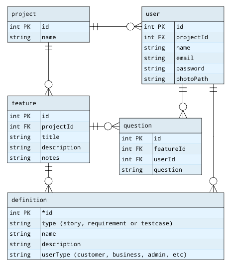

## Schema



## SQL
Run the docker compose file   
   
All accounts have the password "test"   
admin1@gmail.com - image stored at userImages/user1.jpg, project ID 1   
user1@client1.com - project ID 3   
user2@client1.com - project ID 3   
   
## Node app
Open the `/src/` folder    
Run `npm install`    
Install pm2 with `npm install -g pm2` (Run as admin)    
Run the node app with `pm2 start pm2.json`    
pm2 will watch for changes and restart, it will log everything to `src/logs/combined.log`    

## Bypassing auth
By commenting the auth middleware out and adding `req.user = { projectId: 1 }`, every request will bypass auth
```javascript
// This ensures a jwt is detected before serving any other endpoints (except login)
// app.use(function (req, res, next) {
//   if (!req.user && !req.path.startsWith('/users/login')) {
//     res.status(400).json({ error: "Missing or invalid jwt" })
//     return
//   }
//   next()
// })

// This bypasses all auth, comment this out to test auth
// Also uncomment the block above
app.use(function (req, res, next) {
  req.user = { projectId: 1 }
  next()
})
```

## Postman
Be sure to import the tests and the environment.    
There are two valid jwt tokens in the environment. (valid for 30 days)    
`{{jwt1}}` is an admin (project ID 1) which should have access to everything.     
`{{jwt3}}` is a client account which should be able to access anything under project ID 3, including other users, features, questions or definitions.    
When you're ready to add auth, be sure to turn it on by commenting out the bypass middleware and uncommenting the auth middleware.    

## Sequelize Info 
Sequelize models should be fully working    
A few user routes and postman tests demonstrate the basics    
    
You can find some examples of Sequelize usage in this repo:    
    
https://github.com/barrar/sequelize-jwt-demo/blob/main/src/api/businesses.js#L34    
`const pageBusinesses = await seqBusiness.findAll({ offset: start, limit: numPerPage })`    
    
https://github.com/barrar/sequelize-jwt-demo/blob/main/src/api/businesses.js#L80    
`findResult = await seqBusiness.findByPk(businessid, { include: [seqReview, seqPhoto] })`    

https://github.com/barrar/sequelize-jwt-demo/blob/main/src/api/photos.js#L17    
`let createResult = await seqPhoto.create(photo)`    
